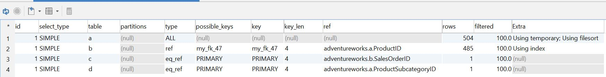
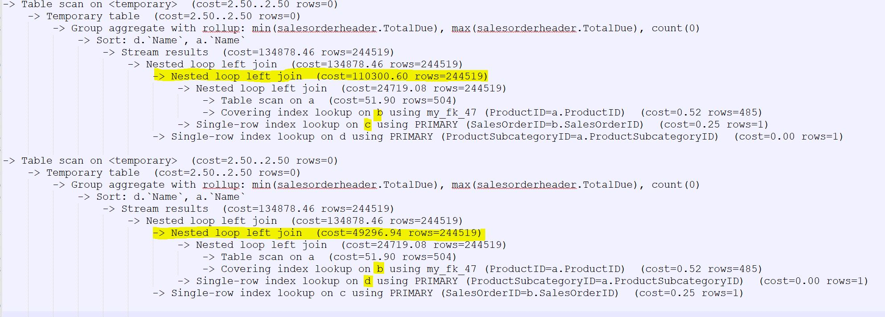
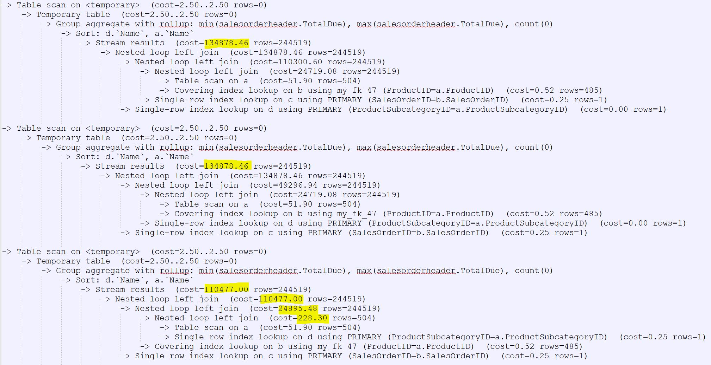

<h1 align="center">ДЗ 16</h1>
<h1 align="center">MySQL Performance optimisation</h1>

---
### Create database ###
```bash
1)
Скачать базу https://github.com/tapsey/AdventureWorksMYSQL
2)
mysql -u root -p AdventureWorks < AdventureWorks-MySQL-with-FKs.sql
```

``В версии MySQL 8.0.15 нет формата TREE(есть только JSON и TRADITIONAL), установил 8.0.27 и он появился.``

### FORMAT=TRADITIONAL ###
```sql
EXPLAIN FORMAT=TRADITIONAL SELECT d.Name AS ProductSubcategoryName,
  CASE
    WHEN (GROUPING(a.Name)=1) THEN 'MIN/MAX price'
    ELSE a.Name
  END AS ProductName,
  MIN(c.TotalDue) AS MINTotalDue,
  MAX(c.TotalDue) AS MAXTotalDue,
  count(*) AS count,
  GROUPING(d.Name) AS grouping_ProductSubcategoryName,
  GROUPING(a.Name) AS grouping_ProductName
FROM product a
LEFT JOIN salesorderdetail b
  ON a.ProductID = b.Productid
LEFT JOIN salesorderheader c
  ON b.SalesOrderID = c.SalesOrderID
LEFT JOIN productsubcategory d
  ON a.ProductSubcategoryID = d.ProductSubcategoryID
GROUP BY d.Name,a.Name WITH ROLLUP;
```

### FORMAT=TREE ###
```sql
EXPLAIN FORMAT=TREE SELECT d.Name AS ProductSubcategoryName,
  CASE
    WHEN (GROUPING(a.Name)=1) THEN 'MIN/MAX price'
    ELSE a.Name
  END AS ProductName,
  MIN(c.TotalDue) AS MINTotalDue,
  MAX(c.TotalDue) AS MAXTotalDue,
  count(*) AS count,
  GROUPING(d.Name) AS grouping_ProductSubcategoryName,
  GROUPING(a.Name) AS grouping_ProductName
FROM product a
LEFT JOIN salesorderdetail b
  ON a.ProductID = b.Productid
LEFT JOIN salesorderheader c
  ON b.SalesOrderID = c.SalesOrderID
LEFT JOIN productsubcategory d
  ON a.ProductSubcategoryID = d.ProductSubcategoryID
GROUP BY d.Name,a.Name WITH ROLLUP;
```
```bash
-> Table scan on <temporary>  (cost=2.50..2.50 rows=0)
    -> Temporary table  (cost=2.50..2.50 rows=0)
        -> Group aggregate with rollup: min(salesorderheader.TotalDue), max(salesorderheader.TotalDue), count(0)
            -> Sort: d.`Name`, a.`Name`
                -> Stream results  (cost=134878.46 rows=244519)
                    -> Nested loop left join  (cost=134878.46 rows=244519)
                        -> Nested loop left join  (cost=110300.60 rows=244519)
                            -> Nested loop left join  (cost=24719.08 rows=244519)
                                -> Table scan on a  (cost=51.90 rows=504)
                                -> Covering index lookup on b using my_fk_47 (ProductID=a.ProductID)  (cost=0.52 rows=485)
                            -> Single-row index lookup on c using PRIMARY (SalesOrderID=b.SalesOrderID)  (cost=0.25 rows=1)
                        -> Single-row index lookup on d using PRIMARY (ProductSubcategoryID=a.ProductSubcategoryID)  (cost=0.00 rows=1)
```
### FORMAT=JSON ###
```sql
EXPLAIN FORMAT=JSON SELECT d.Name AS ProductSubcategoryName,
  CASE
    WHEN (GROUPING(a.Name)=1) THEN 'MIN/MAX price'
    ELSE a.Name
  END AS ProductName,
  MIN(c.TotalDue) AS MINTotalDue,
  MAX(c.TotalDue) AS MAXTotalDue,
  count(*) AS count,
  GROUPING(d.Name) AS grouping_ProductSubcategoryName,
  GROUPING(a.Name) AS grouping_ProductName
FROM product a
LEFT JOIN salesorderdetail b
  ON a.ProductID = b.Productid
LEFT JOIN salesorderheader c
  ON b.SalesOrderID = c.SalesOrderID
LEFT JOIN productsubcategory d
  ON a.ProductSubcategoryID = d.ProductSubcategoryID
GROUP BY d.Name,a.Name WITH ROLLUP;
```
```JSON
{
  "query_block": {
    "select_id": 1,
    "cost_info": {
      "query_cost": "134878.46"
    },
    "grouping_operation": {
      "using_temporary_table": true,
      "using_filesort": true,
      "buffer_result": {
        "using_temporary_table": true,
        "nested_loop": [
          {
            "table": {
              "table_name": "a",
              "access_type": "ALL",
              "rows_examined_per_scan": 504,
              "rows_produced_per_join": 504,
              "filtered": "100.00",
              "cost_info": {
                "read_cost": "1.50",
                "eval_cost": "50.40",
                "prefix_cost": "51.90",
                "data_read_per_join": "204K"
              },
              "used_columns": [
                "ProductID",
                "Name",
                "ProductSubcategoryID"
              ]
            }
          },
          {
            "table": {
              "table_name": "b",
              "access_type": "ref",
              "possible_keys": [
                "my_fk_47"
              ],
              "key": "my_fk_47",
              "used_key_parts": [
                "ProductID"
              ],
              "key_length": "4",
              "ref": [
                "adventureworks.a.ProductID"
              ],
              "rows_examined_per_scan": 485,
              "rows_produced_per_join": 244518,
              "filtered": "100.00",
              "using_index": true,
              "cost_info": {
                "read_cost": "215.32",
                "eval_cost": "24451.86",
                "prefix_cost": "24719.08",
                "data_read_per_join": "33M"
              },
              "used_columns": [
                "SalesOrderID",
                "SalesOrderDetailID",
                "ProductID"
              ]
            }
          },
          {
            "table": {
              "table_name": "c",
              "access_type": "eq_ref",
              "possible_keys": [
                "PRIMARY"
              ],
              "key": "PRIMARY",
              "used_key_parts": [
                "SalesOrderID"
              ],
              "key_length": "4",
              "ref": [
                "adventureworks.b.SalesOrderID"
              ],
              "rows_examined_per_scan": 1,
              "rows_produced_per_join": 244518,
              "filtered": "100.00",
              "cost_info": {
                "read_cost": "61129.66",
                "eval_cost": "24451.86",
                "prefix_cost": "110300.60",
                "data_read_per_join": "173M"
              },
              "used_columns": [
                "SalesOrderID",
                "TotalDue"
              ]
            }
          },
          {
            "table": {
              "table_name": "d",
              "access_type": "eq_ref",
              "possible_keys": [
                "PRIMARY"
              ],
              "key": "PRIMARY",
              "used_key_parts": [
                "ProductSubcategoryID"
              ],
              "key_length": "4",
              "ref": [
                "adventureworks.a.ProductSubcategoryID"
              ],
              "rows_examined_per_scan": 1,
              "rows_produced_per_join": 244518,
              "filtered": "100.00",
              "cost_info": {
                "read_cost": "126.00",
                "eval_cost": "24451.86",
                "prefix_cost": "134878.46",
                "data_read_per_join": "42M"
              },
              "used_columns": [
                "ProductSubcategoryID",
                "Name"
              ]
            }
          }
        ]
      }
    }
  }
}
```
### Попытка оптимизации ###
```sql
--Поменял местами таблицы c и d в left join
EXPLAIN FORMAT=TREE SELECT d.Name AS ProductSubcategoryName,
  CASE
    WHEN (GROUPING(a.Name)=1) THEN 'MIN/MAX price'
    ELSE a.Name
  END AS ProductName,
  MIN(c.TotalDue) AS MINTotalDue,
  MAX(c.TotalDue) AS MAXTotalDue,
  count(*) AS count,
  GROUPING(d.Name) AS grouping_ProductSubcategoryName,
  GROUPING(a.Name) AS grouping_ProductName
FROM product a
LEFT JOIN salesorderdetail b
  ON a.ProductID = b.Productid
LEFT JOIN productsubcategory d
  ON a.ProductSubcategoryID = d.ProductSubcategoryID
LEFT JOIN salesorderheader c
  ON b.SalesOrderID = c.SalesOrderID
GROUP BY d.Name,a.Name WITH ROLLUP;
```


```sql
--Вынес left join таблицы d на первое место и еще сильнее увеличил скорость запроса
EXPLAIN FORMAT=TREE SELECT d.Name AS ProductSubcategoryName,
  CASE
    WHEN (GROUPING(a.Name)=1) THEN 'MIN/MAX price'
    ELSE a.Name
  END AS ProductName,
  MIN(c.TotalDue) AS MINTotalDue,
  MAX(c.TotalDue) AS MAXTotalDue,
  count(*) AS count,
  GROUPING(d.Name) AS grouping_ProductSubcategoryName,
  GROUPING(a.Name) AS grouping_ProductName
FROM product a
LEFT JOIN productsubcategory d
  ON a.ProductSubcategoryID = d.ProductSubcategoryID
LEFT JOIN salesorderdetail b
  ON a.ProductID = b.Productid
LEFT JOIN salesorderheader c
  ON b.SalesOrderID = c.SalesOrderID
GROUP BY d.Name,a.Name WITH ROLLUP;
```


| Database   | ver    |
| -----      | ---    |
| MySQL      | 8.0.27 |
